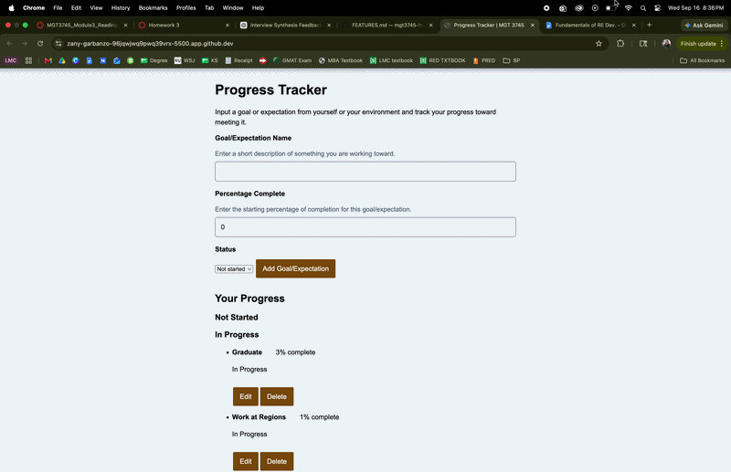
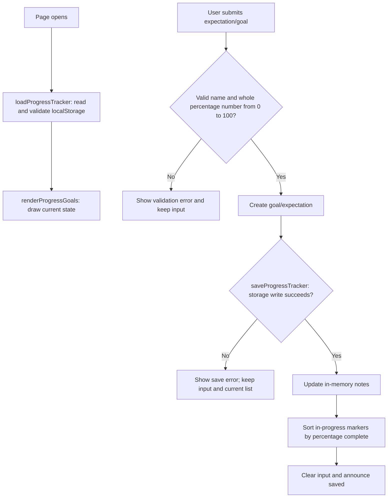

# Progress Tracker

<!-- Badges are optional but cheap. shields.io generates them from a URL. -->

> HW3, MGT 3745 O. Replace every [bracketed prompt] with your own writing.
> Lines between `<!--` and `-->` are notes to you. They are invisible on GitHub. Delete them when done.
> This README is the first thing an employer, a teammate, or an agent reads. It makes
> a case for the repository. Show, then tell.

## What
This Progress Tracker is designed to help users determine whether they are doing enough to meet their own expectations and the expectations of their environment. For HW3, I implemented an editable progress-marker feature that allows users to create goals or expectations, assign a status and percentage complete, edit or remove them, and track their progress over time. In-progress markers are ordered by the user's own percentage of completion so users can see which expectations they have made the most progress toward. The larger problem and its framing are described in [PROJECT.md](context/PROJECT.md), and the detailed feature requirements are documented in [FEATURES.md](context/FEATURES.md).

## See It Work
The editable progress markers feature allows users to create a goal, assign a percentage complete, edit the status/goal, and remove it. In-progress markers are automatically ordered from the highest percentage complete to the lowest. If the assigned percentage is 0%, it gets moved to not started. Similarily, if the assigned percentage is 100%, the goal gets moved to the completed list. 

**The following GIF explicates Acceptance Criterion A - 01:**

## How to Run
This project runs inside a GitHub Codespace. No local install.

1. On your repository page, click **Code → Codespaces → Create codespace on main**. Wait for setup to finish; first-boot time varies.
2. Keep the supplied `.devcontainer/devcontainer.json`. It configures Live Server installation and port 5500 forwarding. Once the extension is ready, right-click `index.html` and choose **Open with Live Server**, or use **Go Live**.
3. If a browser tab does not open, use the **Ports** tab to open port 5500. Keep its visibility **Private**.
4. With Live Server running, save your edits to reload the page.

If Live Server is unavailable, run `node scripts/serve.mjs` in the terminal, then open port 5500 from the Ports tab. Refresh the browser after edits when using this fallback; stop it with **Ctrl+C**. Run only one server on port 5500 at a time. The fallback also works locally with Node 22 or later. Serve over HTTP rather than opening `index.html` through `file://`.

## How It Works

This diagram describes the Progress Tracker's load-and-add flow. In `app.js`, `loadProgressTracker` reads and validates stored data, `getProgressStatus` determines whether a marker is in progress or completed based on its percentage, and `updateStatusOptions` keeps the available status choices consistent with the percentage entered. `editProgressGoal` and `deleteProgressGoal` add edit and delete functionalities, respectively. `renderProgressGoals` displays the current goals and separates them into not-started, in-progress, and completed sections, while also ordering in-progress markers from highest to lowest percentage complete. The submit handler validates input, creates the goal, saves it, and updates displayed content. 

## Status

| Area | State | Why |
|------|-------|-----|
| Create and display progress markers | Works | [Tested by creating a marker and confirming it appears in the progress list.](docs/a-01.gif) |
| Percentage complete | Works | [Tested with valid percentage values (whole number from 0-100) and confirmed the percentage is displayed with the marker.](docs/a-01.gif) |
| Rank in-progress tasks | Works | [Tested with multiple markers at different percentages and confirmed they are ordered from highest to lowest.](docs/percentageRanking.png) |
| Edit progress markers | Works | [Tested by changing a marker's name, status, and percentage.](docs/editTest.gif) |
| Remove progress markers | Works | [Tested by deleting a marker and confirming it is removed from the list.](docs/deleteTest.gif) |
| Invalid percentage input | Works | [Tested with values outside the allowed 0–100 range or goals with no text input.](docs/errorMessage.png) |
| Data survives reload | Works | [Tested by closing out the program and then clicking Go Live after.](docs/dataReload.gif) |
| Multi-user sync | Deferred | [Browser-local storage does not provide multi-user synchronization: ADR-001](context/ARCHITECTURE.md) |

Verification results (click to expand)

The full verification record for each acceptance criterion, including testing steps, expected and observed results, status, and evidence, is documented in the [Verification Section of FEATURES.md](context/FEATURES.md#verification).

## Links

Read in this order:

0. [`SCAFFOLD_MANIFEST.md`](SCAFFOLD_MANIFEST.md): explains what carries over from HW2 into HW3, along with a submission checklist
1. [`context/PROJECT.md`](context/PROJECT.md): the problem and its framing
2. [`context/USERS.md`](context/USERS.md): who this is for
3. [`context/FEATURES.md`](context/FEATURES.md): what it must do, and verification results
4. [`context/ARCHITECTURE.md`](context/ARCHITECTURE.md): the gate and ADR-001
5. [`context/STANDARDS.md`](context/STANDARDS.md): the rules this code follows
6. [`context/CLAUDE.md`](context/CLAUDE.md): the same rules, for agents

The scaffold has **eleven canonical files in `/context`: six active files above and five previews**: [STYLE.md](context/STYLE.md), [TOOLS.md](context/TOOLS.md), [SKILLS.md](context/SKILLS.md), [EVALS.md](context/EVALS.md), and [AGENTS.md](context/AGENTS.md). Keep the previews; verification stays in FEATURES.md until EVALS.md activates in Module 5.

Root README.md and the two instruction adapters—[CLAUDE.md](CLAUDE.md) and [.github/copilot-instructions.md](.github/copilot-instructions.md)—are additional files. Copy your HW2 USERS.md and FEATURES.md into `/context` and revise them using instructor feedback if available; otherwise record a peer criterion check and mark instructor feedback pending. Run `node scripts/check-scaffold.mjs` to check required file presence; this does not assess content quality.

## AI Use

<!-- A Delegation Decision Record without the name. From HW5 this becomes a formal DDR. -->

**Tool and task delegated:** [Which parts a tool drafted: e.g. "Copilot drafted render() and the CSS."]

**Why:** [The reason it made sense to delegate that part rather than write it.]

**How it was checked:** [What you inspected, what you changed, what you caught. "Replaced innerHTML with textContent" is the kind of sentence that belongs here.]

**Observed result / evidence:** [What the checks actually showed; link the relevant verification row, code change, or other evidence. Do not invent a run.]

If no AI assistance was used, say so and describe your independent check. Full Delegation Decision Records begin at HW5; this lightweight record is sufficient here.

**Instruction discovery and compliance:** [Record the tool and mode, which instruction adapter it discovered, and the reference or diagnostic evidence. Separately report whether one generated change followed the applicable standards. If no live AI tool is available, write “not run” and record a manual standards review.]

**Actual hours on this assignment (optional):** [A number, if you choose to report it. The amount or omission does not affect points; the AI-use record does.]

## Explain, Change, Verify

[Identify one function and explain its input, state changes, and output in your own words. Link a meaningful before/after code change, state its expected effect, and record the observed behavior and evidence. Explain why the change matters to your selected requirement. This paragraph is part of the existing README submission.]

<!-- Things this README could also do, if they earn their place:
     - GitHub alerts:  > [!NOTE]  > [!WARNING]  > [!TIP]
     - Task lists:     - [x] done   - [ ] not yet
     - Emoji:          :rocket: :white_check_mark:
     - Footnotes:      text[^1]  ...  [^1]: the note
     - Embedded HTML tables, <kbd>Ctrl</kbd>+<kbd>S</kbd>, , 
     None are required. A README that reads well with none of them beats one that uses all of them. -->
